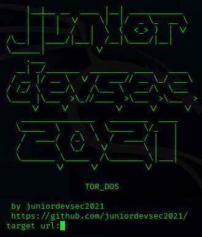
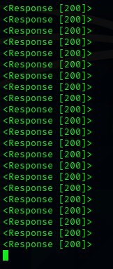

# TOR_DOS
* This program is only for educational purposes it's a Proof Of Concept.
* Sends get request to the target url over tor network.
* Works with clearnet and .onion links.
* ------------------------------------------------------------------
*  SETUP:
* OS - linux/ubuntu distros.
* sudo apt install tor # install tor service.
* pip install requests cython # install requests and cython modules,the os module is default.
*  ------------------------------------------------------------------

* run the program from terminal with command python3 dos.py.

receive the response code.
